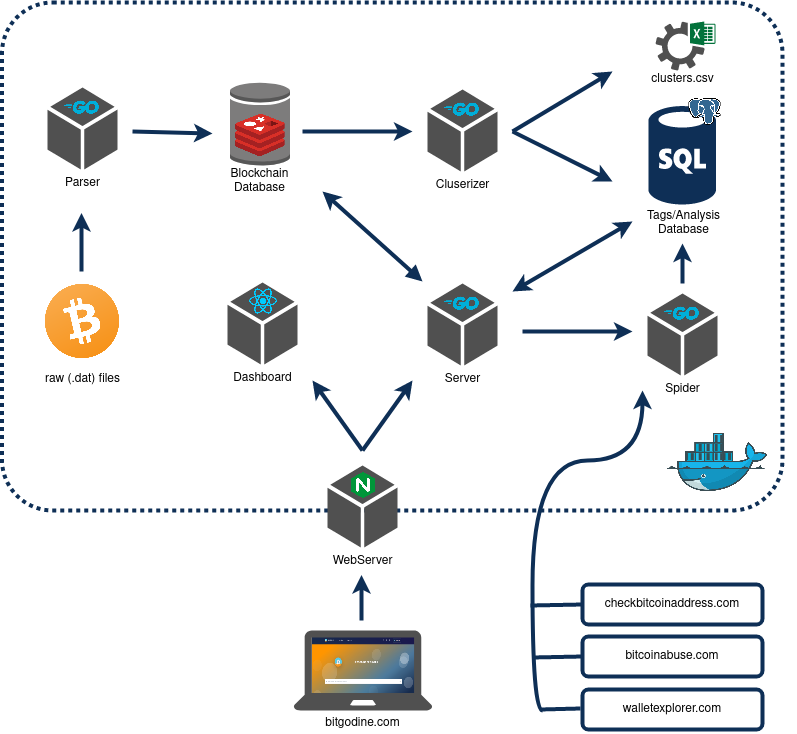

# Services

As shown in the diagram above, bitgodine is composed by a set of indipendent services. 

The external services include a Bitcoin node, in order to download the raw blockchain data, a Redis database, or an alternative supported key value storage, used to store the parsed chain, a Postgres database to store tags and clusters, a Nginx webserver in order to serve all the services. As said in [install](http://127.0.0.1:3000/getting_started/install.html#docker), the whole system is dockerized and can be easily bootstrapped, including the web server.

Bitgodine implements the following services to analyze the blockchain:

- Parser: parses blockchain raw data files and extracts blocks in a convenient format
- Clusterizer: walks the parsed blocks and clusterizes addresses based on [Common Input heuristic](http://127.0.0.1:3000/heuristics/heuristics.html#heuristics).
- Server: REST API the expose multiple endpoints to interact with the bitgodine system
- Spider: crawler service that scrapes the web in order to extract new tags to identify address clusters
- CLI: command line interface that interacts with REST API to expose the same functionalities

In the following we will explain each service into details.
